# Markmap + Mermaid Stress Test

## Baseline sanity
- Plain text node
- Inline code `x = 1`
- **Bold** and *italic*
- Link: https://example.com

## Mixed content density
### Long paragraph (forces wrapping)
This is a deliberately long sentence intended to wrap across multiple lines inside a single Markmap node so we can observe foreignObject sizing changes and post-fit relayout stability after Mermaid injects SVG with labels, arrows, and shapes.

### Nested lists + code
- Level 1
  - Level 2
    - Level 3
      - Level 4 (deep indent)
        - Bullet with a short note
- Fenced code (non-mermaid)
```js
function fib(n){ return n<2?n:fib(n-1)+fib(n-2); }
console.log(fib(10));
````

## Mermaid: small graph

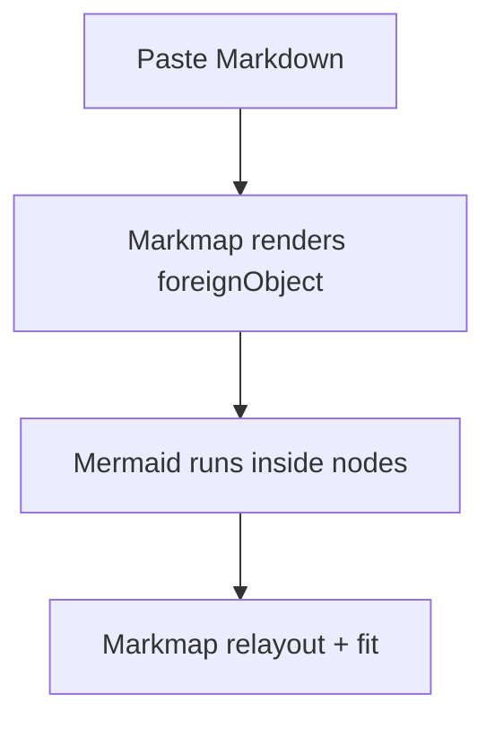

## Mermaid: big graph (label-heavy + many edges)

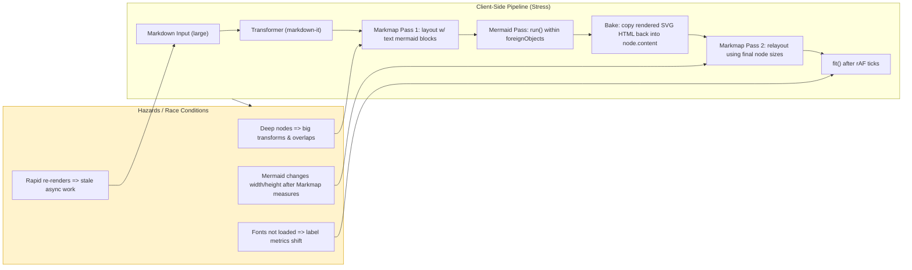

## Mermaid: sequence diagram (taller node)

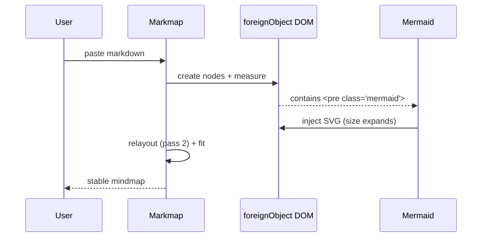

## Mermaid: class diagram (wide labels)

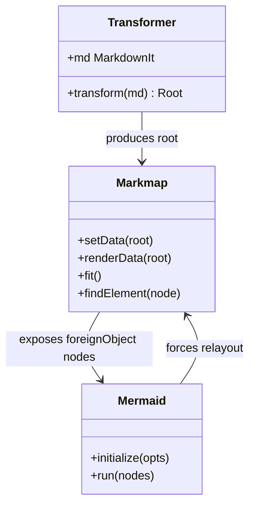

## Mermaid: state diagram (many nodes, loops)

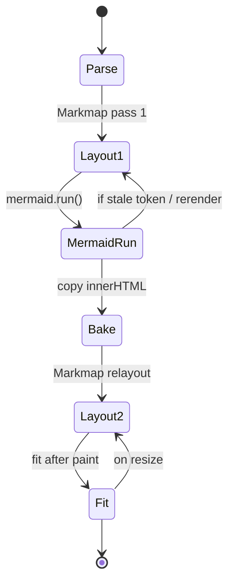

## Mermaid: ER diagram (can be large)

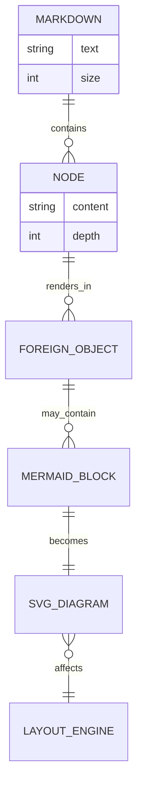

## Intentional edge cases

### Mermaid with lots of text labels (wrapping risk)

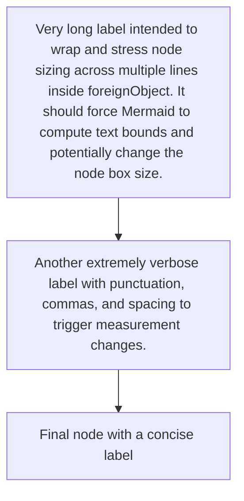

### Mermaid markdown-string edge cases (unquoted labels, <br/>, \\n, quotes)

```mermaid
flowchart LR
  A[START: Human Decision\nin High-Touch Process] --> B{Capture Context}
  B --> C[Decision Inputs\n(Objects + Exceptions)]
  B --> D[Cross-System Signals\n(Slack, Email, Tickets)]
  B --> E[Outcome + Rationale\n("Why")]
  C --> F[Context Graph Node]
  D --> F
  E --> F
  F --> G[Queryable Graph\nwith Precedents]
  G --> H[AI Agent Query\nfor Similar Cases]
  H --> I[Automated Proposal\n+ Confidence Score]
  I --> J{Human Feedback?}
  J -->|Yes| K[Refine Graph\n(Feedback Loop)]
  J -->|No| L[Execute Autonomously]
  K --> G
  L --> M[END: Scalable Autonomy]
  style A fill:#e3f2fd
  style M fill:#e8f5e9
```

```mermaid
flowchart LR
  A[START: Craving Appears] --> B{Identify Want}
  B --> C[Short-Term Pleasure?<br/>vs<br/>Long-Term Strength?]
  C -->|Yes| D[Deny It<br/>Feel Pain]
  C -->|No| E[Allow It<br/>(If Aligned)]
  D --> F[Reflect:<br/>What can I learn?<br/>How to adapt?]
  F --> G[Progress & Capacity ↑]
  E --> H[Maintain Status]
  G --> I[END: Stronger Self]
  H --> I
```

### Mermaid ER diagram relation labels (contrast + pipes)

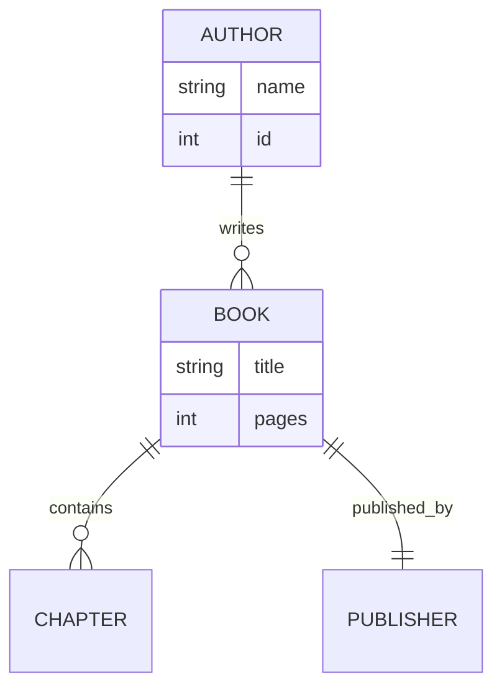

### LaTeX inline + block math (MathJax SVG)

- Inline math: $\to$ $O(1)$, $O(N)$, $x^{1/2}$, $\frac{a}{b}$, $\alpha + \beta$.
- Mixed text + math: Speed is $O(n \log n)$ and memory is $O(n)$.
- Inline code: ``literal $x$`` should stay code, not math.

$$
\int_{0}^{1} x^2 \\, dx = \\frac{1}{3}
$$

$$
\\sum_{i=1}^{n} i = \\frac{n(n+1)}{2}
$$

### Deep hierarchy + multiple mermaids at same level

#### Branch A

* A1

  * A2

    * A3

      * A4

        * A5

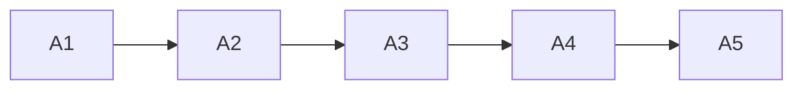

#### Branch B

* B1

  * B2

    * B3

      * B4

        * B5

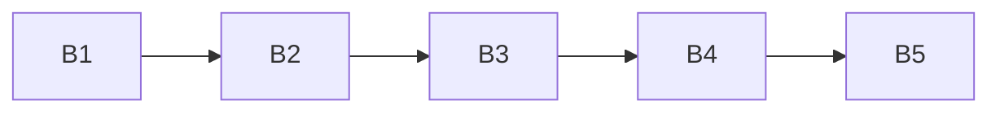

## Additional diagram types (nested list)

- Parent node
  - DOT child
    ```dot
    // engine: dot
    digraph G { rankdir=LR; A -> B -> C; }
    ```
  - WaveDrom child
    ```wavedrom
    { signal: [
      { name: "clk", wave: "p....." },
      { name: "req", wave: "01..0." },
      { name: "ack", wave: "0.1..0" }
    ], head: { text: "join late data timeline", tick: 0, every: 2 } }
    ```
  - Vega-Lite child
    ```vega-lite
    {
      "$schema": "https://vega.github.io/schema/vega-lite/v6.json",
      "width": 260,
      "height": 160,
      "data": { "values": [
        {"k":"A","v":28}, {"k":"B","v":55}, {"k":"C","v":43}
      ]},
      "mark": "bar",
      "encoding": {
        "x": {"field":"k","type":"nominal"},
        "y": {"field":"v","type":"quantitative"}
      }
    }
    ```

## Example renderers (quick sanity)

### Nested list

- Parent node
  - DOT child
    ```dot
    digraph G { rankdir=LR; A -> B -> C; }
    ```
  - WaveDrom child
    ```wavedrom
    { signal: [
      { name: "clk", wave: "p....." },
      { name: "req", wave: "01..0." },
      { name: "ack", wave: "0.1..0" }
    ], head: { text: "join late data timeline", tick: 0, every: 2 } }
    ```
  - Vega-Lite child
    ```vega-lite
    {
      "$schema": "https://vega.github.io/schema/vega-lite/v6.json",
      "width": 260,
      "height": 160,
      "data": { "values": [
        {"k":"A","v":28}, {"k":"B","v":55}, {"k":"C","v":43}
      ]},
      "mark": "bar",
      "encoding": {
        "x": {"field":"k","type":"nominal"},
        "y": {"field":"v","type":"quantitative"}
      }
    }
    ```

### Mermaid baseline

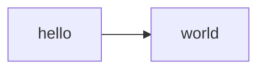

## Footer

* If this renders without overlaps after the Mermaid pass + relayout, the orchestration is working.
