## 🔗 Source
- https://every.to/chain-of-thought/compound-engineering-how-every-codes-with-agents :contentReference[oaicite:0]{index=0}

## 🧠 Core Thesis: “Compound Engineering”
- Traditional engineering expectation: each feature → next feature harder (complexity debt)
- Compound engineering expectation: each feature → next feature easier (learning loop)
- Mechanism: bugs + failed tests + a-ha insights → captured as reusable “system memory” for agents
- Claim: single dev can do work of ~5 devs (when system harnesses agents well) :contentReference[oaicite:1]{index=1}

## 🔁 The 4-Step Loop (the “compound engineering loop”)
- 1) Plan: agents research + synthesize into implementation plan
- 2) Work: agents implement plan + write tests
- 3) Review/Assess: agent self-review + human review + automated checks
- 4) Compound: convert learnings into durable rules/prompts so next loop improves :contentReference[oaicite:2]{index=2}
- Time allocation heuristic: ~80% Plan+Review, ~20% Work+Compound :contentReference[oaicite:3]{index=3}
- Tooling: mainly Claude Code; also Factory Droid + OpenAI Codex CLI; workflow is tool-agnostic :contentReference[oaicite:4]{index=4}

## 1️⃣ Plan (where dev time moves)
- Planning becomes primary dev work when agents write 100% of code :contentReference[oaicite:5]{index=5}
- Inputs to plan
  - Codebase structure + conventions (read repo + commit history)
  - External best practices relevant to task (internet research)
- Output: a plan doc (file or GitHub issue) containing
  - Objective + architecture
  - Concrete implementation ideas
  - Research sources
  - Success criteria :contentReference[oaicite:6]{index=6}
- Principle: “not pure delegation” — human taste/creativity pushes agent down correct paths :contentReference[oaicite:7]{index=7}

## 2️⃣ Work (simple; accelerate w/ tool-use)
- Developer instruction: “start working” (agent turns plan into to-do list, builds step-by-step) :contentReference[oaicite:8]{index=8}
- Key trick: use tool protocols (e.g., Playwright / XcodeBuildMCP) so agent can
  - run/drive app like a user (web/phone simulation)
  - iterate: write code → test via tool → notice issues → patch → repeat :contentReference[oaicite:9]{index=9}
- Observation: newer agents (e.g., “Opus 4.5” mentioned) increase probability of functional, near-intended output (given a solid plan) :contentReference[oaicite:10]{index=10}

## 3️⃣ Assess (multi-perspective evaluation)
- Agent reviews its own work; human reviews too :contentReference[oaicite:11]{index=11}
- Techniques
  - Traditional: linters + unit tests
  - Manual testing: sanity-check behavior
  - Review agents: Claude, Codex, etc. for spot-checks :contentReference[oaicite:12]{index=12}
- Plugin example: parallel subagents (e.g., ~12) each with a lens:
  - security issues, performance, overbuilding/bloat, etc.
  - synthesis into actionable summary for human judgment :contentReference[oaicite:13]{index=13}

## 4️⃣ Compound (the “money step”)
- Goal: never hit the same class of problems again :contentReference[oaicite:14]{index=14}
- What gets captured
  - bugs encountered
  - performance pitfalls
  - better patterns discovered
  - review feedback distilled into rules
- How it’s used (Cora example)
  - before new work, agent asks: “Where does this belong?”, “Do we already have this?”, “Similar solved before?” with concrete prior examples :contentReference[oaicite:15]{index=15}
- Distribution effect: lessons stored in codebase / plugin prompts → all devs get improvements “for free” (new hire parity boost) :contentReference[oaicite:16]{index=16}

## 🧩 “Compound Engineer” Role (what changes vs classic SWE)
- From: primarily writing code
- To: orchestrating parallel agents + enforcing learning loop
- Scarcity shifts
  - less scarce: typing code, boilerplate, first-draft tests/docs
  - more scarce: defining success, architecture judgment, review discernment, systemizing learnings :contentReference[oaicite:17]{index=17}

## 📦 Artifacts Every emphasizes (operationalize the loop)
- Plan doc template (objective, architecture, sources, success criteria) :contentReference[oaicite:18]{index=18}
- Tool-integrated work loops (Playwright / XcodeBuildMCP) :contentReference[oaicite:19]{index=19}
- Multi-agent review report (perspective synthesis) :contentReference[oaicite:20]{index=20}
- “Memory” store (prompts/rules in repo or plugin) feeding next iteration :contentReference[oaicite:21]{index=21}

## ⚖️ Quick Comparison Table (classic vs compound)
| Dimension | Classic engineering | Compound engineering |
|---|---|---|
| Primary bottleneck | writing code | deciding + planning + reviewing |
| Quality control | tests + code review | tests + code review + parallel agent critique |
| Repetition | recurring bugs/pattern drift | lessons captured → default prevention |
| Scaling | add engineers | add better loops + memory |
| Knowledge transfer | docs + onboarding | prompts/rules embedded; auto-distributed :contentReference[oaicite:22]{index=22} |

## 🧪 Practical Heuristics (compressed)
- Plan quality dominates output quality (esp. complex prod systems) :contentReference[oaicite:23]{index=23}
- Assess must be adversarial: assume agent is “confidently wrong” sometimes
- Compounding requires explicit capture; otherwise you’re doing “AI engineering” not “compound engineering” (prompt→ship→forget pattern implied by contrast) :contentReference[oaicite:24]{index=24}

## 🧮 Minimal mental model (math-ish)
- Let v = velocity per iteration, m = memory gain factor per loop
- Classic: v_t ≈ constant, complexity grows
- Compound: v_{t+1} = v_t · (1 + m_t) where m_t comes from captured lessons
- Goal: increase m_t by converting each failure into a reusable constraint

```mermaid
flowchart LR
  START(["`START\nVelocity model`"])
  V0["`v#8320;\nbase agent speed`"]
  M["`m\nmemory gain\nfrom compounding`"]
  V1["`v#8321; = v#8320;#32;·#32;#40;1#m#41;`"]
  END(["`END\nFaster next loop`"])
  START-->V0-->M-->V1-->END
```

## 🔚 Looking ahead (implications they claim)
- Manually writing tests + human-readable docs becomes less necessary (agents can generate) :contentReference[oaicite:25]{index=25}
- Hiring/assessment norms shift (coding without internet becomes nonsensical) :contentReference[oaicite:26]{index=26}
- Replatforming lock-in decreases (legacy comprehension cost drops when agents understand code) :contentReference[oaicite:27]{index=27}

## 🔗 Related reading listed in the article
- “Stop Coding and Start Planning”
- “Teach Your AI to Think Like a Senior Engineer”
- “My AI Had Already Fixed the Code Before I Saw It”
- “How Every Is Harnessing the World-changing Shift of Opus 4.5” :contentReference[oaicite:28]{index=28}
